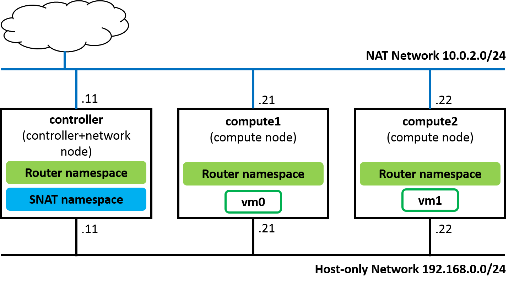
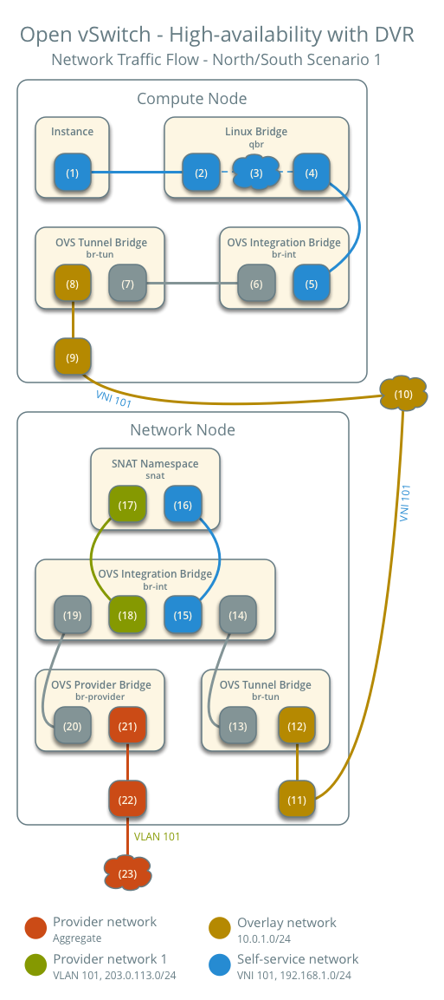

=================================
Devstack deployment with DVR SNAT
=================================

This document intends to explain how to deploy Devstack multi-node in
Rocky with DVR enabling which is useful for actual operation and development.

.. contents:: **Table of Contents**
   :depth: 2

Neutron Distributed Virtual Router (DVR)
========================================

Architecture concept of High Availability with DVR [1]_

.. image:: figures/deploy-ovs-ha-dvr-overview.png
   :alt: HA with DVR overview

Environment
===========

Environment

* Ubuntu 16.04.3 amd64
* Virtualbox installation with the following networks:

  * NAT network: ``10.0.2.0/24``
  * Host-only network: ``192.168.0.0/24``

Topology

Config network interface in **/etc/network/interfaces**

* controller

.. code-block:: bash

    auto enp0s3
    iface enp0s3 inet static
    address 10.0.2.11
    netmask 255.255.255.0
    gateway 10.0.2.2
    dns-nameservers 8.8.8.8 8.8.4.4

    auto enp0s9
    iface enp0s9 inet static
    address 192.168.0.11
    netmask 255.255.255.0

* compute1

.. code-block:: bash

    auto enp0s3
    iface enp0s3 inet static
    address 10.0.2.21
    netmask 255.255.255.0
    gateway 10.0.2.2
    dns-nameservers 8.8.8.8 8.8.4.4

    auto enp0s9
    iface enp0s9 inet static
    address 192.168.0.21
    netmask 255.255.255.0

* compute2

.. code-block:: bash

    auto enp0s3
    iface enp0s3 inet static
    address 10.0.2.22
    netmask 255.255.255.0
    gateway 10.0.2.2
    dns-nameservers 8.8.8.8 8.8.4.4

    auto enp0s9
    iface enp0s9 inet static
    address 192.168.0.22
    netmask 255.255.255.0

.. note::

  If your Virtualbox machines stand behind proxy, you might need to set up
  **no_proxy** for host-only network that connects Openstack nodes internally.

  .. code-block:: bash

     export no_proxy=localhost,127.0.0.1,10.0.2.0/24,192.168.0.0/24

Configure Controller + Network Node
-----------------------------------

The values for **Q_DVR_MODE** is set to **dvr_snat** (controller or single node),
or **dvr** (compute node in multi-node).

This is controller and network node, then **n-cpu** is disabled in this node

* Sample **local.conf** for controller + network node

.. code-block:: yaml

    [[local|localrc]]
    ADMIN_PASSWORD=abc123
    DATABASE_PASSWORD=abc123
    RABBIT_PASSWORD=abc123
    SERVICE_PASSWORD=$ADMIN_PASSWORD
    GIT_BASE=${GIT_BASE:-https://git.openstack.org}

    HOST_IP=192.168.0.11

    LOGFILE=$DEST/logs/stack.sh.log
    LOGDAYS=2

    #Disable Cinder
    disable_service c-api
    disable_service c-vol
    disable_service c-sch

    #######################################
    #Config DVR SNAT

    MULTI_HOST=1 # Multi-node enabling

    #THIS IS CONTROLLER AND NETWORK ONLY, NOT COMPUTE !!
    disable_service n-cpu

    # Settings for DVR networking, DVR depends on vxlan and ml2/ovs
    Q_USE_SECGROUP=True
    Q_PLUGIN=ml2
    Q_ML2_TENANT_NETWORK_TYPE=vxlan

    Q_DVR_MODE=dvr_snat # In controller node, enable dvr_snat

    [[post-config|/$Q_PLUGIN_CONF_FILE]]
    [agent]
    arp_responder=True

    #######################################
    # Config Neutron services
    disable_service n-net
    enable_plugin neutron https://git.openstack.org/openstack/neutron

    # Enable Neutron services
    ENABLED_SERVICES=q-svc,q-agt,q-dhcp,q-l3,q-meta,q-metering

    # Enable logging service in Neutron
    enable_service q-log
    disable_service q-qos

    # Enable FWaaS V2 service
    enable_plugin neutron-fwaas https://git.openstack.org/openstack/neutron-fwaas master
    enable_plugin neutron-fwaas-dashboard https://git.openstack.org/openstack/neutron-fwaas-dashboard master
    enable_service q-fwaas-v2

    # Enable logging for Firewall
    [[post-config|/etc/neutron/l3_agent.ini]]
    [AGENT]
    extensions = fwaas_v2,fwaas_v2_log

Configure Compute Nodes
-----------------------

In order to enable distributed router on each compute-node, Neutron-metadata-agent
and Neutron-L3-agent are both needed. So we need to add **q-meta** and **q-l3**
as well as **q-agt** on each computer node's **local.conf** file.

The values for Q_DVR_MODE are set to **dvr_snat** (controller or single node),
or **dvr** (compute node in multi-node).

* Sample **local.conf** for compute nodes

.. code-block:: yaml

    [[local|localrc]]
    HOST_IP=192.168.0.21 # change this per compute node

    LOGFILE=/opt/stack/logs/stack.sh.log
    GIT_BASE=${GIT_BASE:-https://git.openstack.org}

    ADMIN_PASSWORD=abc123
    DATABASE_PASSWORD=abc123
    RABBIT_PASSWORD=abc123
    SERVICE_PASSWORD=abc123

    #######################################
    #Config DVR SNAT

    MULTI_HOST=1 # Multi-node enabling

    DATABASE_TYPE=mysql
    SERVICE_HOST=192.168.0.11
    MYSQL_HOST=$SERVICE_HOST
    RABBIT_HOST=$SERVICE_HOST
    GLANCE_HOSTPORT=$SERVICE_HOST:9292

    # Services that a compute node runs
    ENABLED_SERVICES=n-cpu,n-api-meta,c-vol,placement-client,placement-api,q-agt,q-l3,q-meta,neutron

    NOVA_VNC_ENABLED=True
    NOVNCPROXY_URL="http://$SERVICE_HOST:6080/vnc_auto.html"
    VNCSERVER_LISTEN=$HOST_IP
    VNCSERVER_PROXYCLIENT_ADDRESS=$VNCSERVER_LISTEN

    #Enable Neutron service
    disable_service n-net

    # Settings for DVR networking, DVR depends on vxlan and ml2/ovs
    Q_USE_SECGROUP=True
    Q_PLUGIN=ml2
    Q_ML2_TENANT_NETWORK_TYPE=vxlan
    Q_DVR_MODE=dvr

    [[post-config|/$Q_PLUGIN_CONF_FILE]]
    [agent]
    arp_responder=True
    #######################################

    #Disable Cinder
    disable_service c-api
    disable_service c-vol
    disable_service c-sch

Devstack deployment
===================

* Install devstack with **./stack.sh** in **controller**, **compute1** and **compute2** node.

* Config DVR mode after Devstack deployment

  * In network node, edit **/etc/neutron/neutron.conf** with

  .. code-block:: yaml

    [DEFAULT]
    router_distributed = True

  * In network node, edit **/etc/neutron/l3_agent.conf** with

  .. code-block:: yaml

    [DEFAULT]
    agent_mode = dvr_snat

  * In compute node, edit **/etc/neutron/l3_agent.conf** with

  .. code-block:: yaml

    [DEFAULT]
    agent_mode = dvr

  * In network node and compute nodes, edit **/etc/neutron/plugins/ml2/ml2_conf.ini** with

  .. code-block:: yaml

    [ml2]
    mechanism_drivers = openvswitch,linuxbridge,l2population
    
    [agent]
    enable_distributed_routing = True
    l2_population = True
    arp_responder = True

* Verify service operation

  * Source the administrative project credentials.
  * Verify presence and operation of the network agents.

  .. code-block:: console

        $ openstack network agent list
        +--------------------------------------+--------------------+------------+-------------------+-------+-------+---------------------------+
        | ID                                   | Agent Type         | Host       | Availability Zone | Alive | State | Binary                    |
        +--------------------------------------+--------------------+------------+-------------------+-------+-------+---------------------------+
        | 13535972-44dd-42f0-af66-6504de74f02b | Open vSwitch agent | compute1   | None              | :-)   | UP    | neutron-openvswitch-agent |
        | 23a89fa2-f2c9-45b2-be7d-8dfe3402ba02 | Open vSwitch agent | compute2   | None              | :-)   | UP    | neutron-openvswitch-agent |
        | 404d95e9-a5c8-4804-953e-240d7bb299f6 | Metadata agent     | compute1   | None              | :-)   | UP    | neutron-metadata-agent    |
        | 501ff96b-8459-4941-a65d-df5bbd2dfa33 | L3 agent           | compute2   | nova              | :-)   | UP    | neutron-l3-agent          |
        | 5ece9239-406a-4b76-862e-9ab6e85c1791 | Metadata agent     | controller | None              | :-)   | UP    | neutron-metadata-agent    |
        | 5f7130d1-77b7-4cc7-a6e6-f91c738de787 | Metering agent     | controller | None              | :-)   | UP    | neutron-metering-agent    |
        | 77f4602d-7f1b-4632-95e9-7a39cdc2a2ff | DHCP agent         | controller | nova              | :-)   | UP    | neutron-dhcp-agent        |
        | 8f8cc18c-5d46-4d6c-b0df-78753accec58 | Open vSwitch agent | controller | None              | :-)   | UP    | neutron-openvswitch-agent |
        | ba83cfa3-c655-4951-8d3d-99c6de065e27 | L3 agent           | controller | nova              | :-)   | UP    | neutron-l3-agent          |
        | d691a10f-4f7a-42ba-bdda-640376e50d12 | L3 agent           | compute1   | nova              | :-)   | UP    | neutron-l3-agent          |
        | dae766f2-8cf2-449b-b65a-5fc59e11621e | Metadata agent     | compute2   | None              | :-)   | UP    | neutron-metadata-agent    |
        +--------------------------------------+--------------------+------------+-------------------+-------+-------+---------------------------+

  .. note::

     * **Open vSwitch agent**, **L3 agent** and **Metadata agent** are still launched
       in both **controller**, **compute1** and **compute2**.

  * Verify presence and operation of the compute services.

  .. code-block:: console

        $ openstack compute service list
        +----+------------------+------------+----------+---------+-------+----------------------------+
        | ID | Binary           | Host       | Zone     | Status  | State | Updated At                 |
        +----+------------------+------------+----------+---------+-------+----------------------------+
        |  3 | nova-scheduler   | controller | internal | enabled | up    | 2018-10-09T07:00:40.000000 |
        |  6 | nova-consoleauth | controller | internal | enabled | up    | 2018-10-09T07:00:44.000000 |
        |  7 | nova-conductor   | controller | internal | enabled | up    | 2018-10-09T07:00:47.000000 |
        |  1 | nova-conductor   | controller | internal | enabled | up    | 2018-10-09T07:00:48.000000 |
        |  2 | nova-compute     | compute1   | nova     | enabled | up    | 2018-10-09T07:00:49.000000 |
        |  3 | nova-compute     | compute2   | nova     | enabled | up    | 2018-10-09T07:00:44.000000 |
        +----+------------------+------------+----------+---------+-------+----------------------------+

  .. note::

     * **nova-compute** only launced in **compute1** and **compute2** as configuration in **controller**

* To disable/enable compute service in compute node

.. code-block:: console

    $ openstack compute service set --disable compute2 nova-compute
    $ openstack compute service list
    +----+------------------+------------+----------+----------+-------+----------------------------+
    | ID | Binary           | Host       | Zone     | Status   | State | Updated At                 |
    +----+------------------+------------+----------+----------+-------+----------------------------+
    |  3 | nova-scheduler   | controller | internal | enabled  | up    | 2018-10-09T07:03:20.000000 |
    |  6 | nova-consoleauth | controller | internal | enabled  | up    | 2018-10-09T07:03:24.000000 |
    |  7 | nova-conductor   | controller | internal | enabled  | up    | 2018-10-09T07:03:17.000000 |
    |  1 | nova-conductor   | controller | internal | enabled  | up    | 2018-10-09T07:03:18.000000 |
    |  2 | nova-compute     | compute1   | nova     | enabled  | up    | 2018-10-09T07:03:19.000000 |
    |  3 | nova-compute     | compute2   | nova     | disabled | up    | 2018-10-09T07:03:24.000000 |
    +----+------------------+------------+----------+----------+-------+----------------------------+

* Add the compute node to the cell database [2]_

  * To confirm there are compute hosts in the database

  .. code-block:: console

    $ openstack hypervisor list
    +----+---------------------+-----------------+--------------+-------+
    | ID | Hypervisor Hostname | Hypervisor Type | Host IP      | State |
    +----+---------------------+-----------------+--------------+-------+
    |  1 | compute1            | QEMU            | 192.168.0.21 | up    |
    |  2 | compute2            | QEMU            | 192.168.0.22 | up    |
    +----+---------------------+-----------------+--------------+-------+

  * When you add new compute nodes, you must run ``nova-manage cell_v2 discover_hosts``
    on the controller node to register those new compute nodes.To discover compute
    hosts, run the following commands on the controller node:

  .. code-block:: console

    $ su -s /bin/sh -c "nova-manage cell_v2 discover_hosts --verbose" stack
    Password:
    /usr/local/lib/python2.7/dist-packages/psycopg2/__init__.py:144: UserWarning: The psycopg2 wheel package will be renamed from release 2.8; in order to keep installing from binary please use "pip install psycopg2-binary" instead. For details see: <http://initd.org/psycopg/docs/install.html#binary-install-from-pypi>.
      """)
    Found 2 cell mappings.
    Skipping cell0 since it does not contain hosts.
    Getting computes from cell 'cell1': 1d71bb46-e9f3-48b4-8f2c-5b835fbb5420
    Found 2 unmapped computes in cell: 1d71bb46-e9f3-48b4-8f2c-5b835fbb5420

Openstack Network Configuration
===============================

The following script is able to deploy Neutron networks with DVR router

.. code-block:: console

    # Create net0 with subnet subnet0
    openstack network create --share net0
    openstack subnet create subnet0 --ip-version 4 --gateway 10.10.0.1 --network net0 --subnet-range 10.10.0.0/24

    # Create net1 with subnet subnet1
    openstack network create --share net1
    openstack subnet create subnet1 --ip-version 4 --gateway 10.10.1.1 --network net1 --subnet-range 10.10.1.0/24

    # Create router router0 and attach subnet0, subnet1 to router0
    openstack router create router0
    openstack router add subnet router0 subnet0
    openstack router add subnet router0 subnet1

    # Set gateway for router0
    openstack router set router0 --external-gateway public --enable-snat

    # Create vm0, vm1 and attach to net0, net1
    openstack server create  vm0 --image cirros-0.3.5-x86_64-disk --flavor m1.tiny --network net0 --availability-zone nova:compute1:compute1
    openstack server create  vm1 --image cirros-0.3.5-x86_64-disk --flavor m1.tiny --network net1 --availability-zone nova:compute2:compute2

The Neutron networks and router interfaces should look like:

.. image:: figures/devstack_topo.PNG
   :alt: Devstack Topology with router infomation

In DVR implementation, SNAT namespace is created in network node by default.

From **controller**,

.. code-block:: console

    $ openstack router list
    +--------------------------------------+---------+--------+-------+-------------+-------+----------------------------------+
    | ID                                   | Name    | Status | State | Distributed | HA    | Project                          |
    +--------------------------------------+---------+--------+-------+-------------+-------+----------------------------------+
    | 2998ef0e-9fe3-4f60-ba55-dbd631518538 | router0 | ACTIVE | UP    | True        | False | 2b6956584a4a456fafe52707c5961f07 |
    +--------------------------------------+---------+--------+-------+-------------+-------+----------------------------------+

    $ ip netns
    snat-2998ef0e-9fe3-4f60-ba55-dbd631518538
    qrouter-2998ef0e-9fe3-4f60-ba55-dbd631518538
    qdhcp-aa938ea7-fb9b-4aaa-a78a-2ca02624e737
    fip-cd1abffe-1b36-49db-944d-5353e930a4df
    qdhcp-1f9030b6-50ff-4c24-9152-c48fe6eee55b

In **compute1** and **compute2**, **qrouter-*** namespace is also created. Note
that there is no SNAT namespace in compute nodes.

.. code-block:: console

    $ virsh list
     Id    Name                           State
    ----------------------------------------------------
     1     instance-00000002              running

    $ ip netns
    fip-cd1abffe-1b36-49db-944d-5353e930a4df
    qrouter-2998ef0e-9fe3-4f60-ba55-dbd631518538

In this guide, we set up North-South traffic to check SNAT operation in DVR router.
In particular, we **ping** from **10.10.0.4** (vm0) to external network address
**172.24.4.1** (br-ex). The results show as bellow:

.. code-block:: console

    $ ifconfig
    eth0      Link encap:Ethernet  HWaddr FA:16:3E:2D:4C:F6
              inet addr:10.10.0.4  Bcast:10.0.0.255  Mask:255.255.255.0
              inet6 addr: fe80::f816:3eff:fe2d:4cf6/64 Scope:Link
              UP BROADCAST RUNNING MULTICAST  MTU:1450  Metric:1
              RX packets:95 errors:0 dropped:0 overruns:0 frame:0
              TX packets:104 errors:0 dropped:0 overruns:0 carrier:0
              collisions:0 txqueuelen:1000
              RX bytes:9662 (9.4 KiB)  TX bytes:10258 (10.0 KiB)

    lo        Link encap:Local Loopback
              inet addr:127.0.0.1  Mask:255.0.0.0
              inet6 addr: ::1/128 Scope:Host
              UP LOOPBACK RUNNING  MTU:16436  Metric:1
              RX packets:0 errors:0 dropped:0 overruns:0 frame:0
              TX packets:0 errors:0 dropped:0 overruns:0 carrier:0
              collisions:0 txqueuelen:0
              RX bytes:0 (0.0 B)  TX bytes:0 (0.0 B)

    $ ping 172.24.4.1
    PING 172.24.4.1 (172.24.4.1): 56 data bytes
    64 bytes from 172.24.4.1: seq=0 ttl=63 time=2.559 ms
    64 bytes from 172.24.4.1: seq=1 ttl=63 time=3.272 ms
    64 bytes from 172.24.4.1: seq=2 ttl=63 time=2.416 ms

    --- 172.24.4.1 ping statistics ---
    5 packets transmitted, 5 packets received, 0% packet loss
    round-trip min/avg/max = 2.128/2.555/3.272 ms

Iptables statistic change in SNAT namespace

.. code-block:: console

    $ sudo ip netns exec snat-2998ef0e-9fe3-4f60-ba55-dbd631518538 iptables -t nat -nvL
    Chain PREROUTING (policy ACCEPT 10 packets, 1256 bytes)
     pkts bytes target     prot opt in     out     source               destination
       10  1256 neutron-l3-agent-PREROUTING  all  --  *      *       0.0.0.0/0            0.0.0.0/0

    Chain INPUT (policy ACCEPT 2 packets, 636 bytes)
     pkts bytes target     prot opt in     out     source               destination

    Chain OUTPUT (policy ACCEPT 0 packets, 0 bytes)
     pkts bytes target     prot opt in     out     source               destination
        0     0 neutron-l3-agent-OUTPUT  all  --  *      *       0.0.0.0/0            0.0.0.0/0

    Chain POSTROUTING (policy ACCEPT 0 packets, 0 bytes)
     pkts bytes target     prot opt in     out     source               destination
        8   620 neutron-l3-agent-POSTROUTING  all  --  *      *       0.0.0.0/0            0.0.0.0/0
        8   620 neutron-postrouting-bottom  all  --  *      *       0.0.0.0/0            0.0.0.0/0

    Chain neutron-l3-agent-OUTPUT (1 references)
     pkts bytes target     prot opt in     out     source               destination

    Chain neutron-l3-agent-POSTROUTING (1 references)
     pkts bytes target     prot opt in     out     source               destination
        0     0 ACCEPT     all  --  !qg-41aabfc4-b5 !qg-41aabfc4-b5  0.0.0.0/0            0.0.0.0/0            ! ctstate DNAT

    Chain neutron-l3-agent-PREROUTING (1 references)
     pkts bytes target     prot opt in     out     source               destination

    Chain neutron-l3-agent-float-snat (1 references)
     pkts bytes target     prot opt in     out     source               destination

    Chain neutron-l3-agent-snat (1 references)
     pkts bytes target     prot opt in     out     source               destination
        8   620 neutron-l3-agent-float-snat  all  --  *      *       0.0.0.0/0            0.0.0.0/0
        8   620 SNAT       all  --  *      qg-41aabfc4-b5  0.0.0.0/0            0.0.0.0/0            to:172.24.4.5
        0     0 SNAT       all  --  *      *       0.0.0.0/0            0.0.0.0/0            mark match ! 0x2/0xffff ctstate DNAT to:172.24.4.5

    Chain neutron-postrouting-bottom (1 references)
     pkts bytes target     prot opt in     out     source               destination
        8   620 neutron-l3-agent-snat  all  --  *      *       0.0.0.0/0            0.0.0.0/0            /* Perform source NAT on outgoing traffic. */

Network traffic flow
====================

The DVR communication scenarios could be devided into four types:

* Same Subnet / Different compute-node
* Different Subnet / Different compute-node
* SNAT (Instance with fixed IP)
* Floating-IP

In this guide, we focus on North-South scenario with **SNAT (Instance with fixed IP)**

North-South scenario (Instance with fixed IP)
---------------------------------------------

When DVR router is created with SNAT enabling, the following namespaces are added:

* In **controller**

  * snat-$router_id
  * qrouter-$router_id

* In **compute1**, **compute2**

  * qrouter-$router_id

In the case of SNAT, SNAT processing (iptables) is executed in **snat-$router0_id** namespace in network node

The Packet Flow should look like the following figure [3]_:

* In compute node

  * Instance (1) -> SG bridge (2) -> SG firewall (3) -> OVS br-int (5)
  * OVS br-int add an internal VLAN tag to the packet
  * OVS br-int exchange the internal VLAN tag to internal tunnel ID and forward packet to br-tun (6) (7)
  * br-tun wraps packet with VNI 101 (8) and forward wrapped packet to br-tun in network node (9) (10) (11) (12)

* In network node

  * br-tun unwraps packet and add an internal ID to it.
  * br-tun exchanges internal tunnel ID with an internal VLAN tag and forward packet to br-int (13)(14)
  * br-int removes internal VLAN tag (15) and forward to self-service network interface (16) in router namespace.

    * IPv4: router namespace performs SNAT (change source IP to router IP on provider network) and send it to gateway IP address on provider network (17)
    * IPv6: router sends packet to the next-hop IP address

  * Router forwards packet to provider network (18) (19) (20)
  * The br-provider swaps the internal VLAN tag with actual VLAN tag 101 and forwards packet to the physical network interface (21) (22)
  * The physical network forwards packet to the Internet (23)

References
==========

.. [1] https://docs.openstack.org/neutron/pike/admin/deploy-ovs-ha-dvr.html#architecture
.. [2] https://docs.openstack.org/ocata/install-guide-rdo/nova-compute-install.html#add-the-compute-node-to-the-cell-database
.. [3] https://docs.openstack.org/neutron/pike/admin/deploy-ovs-ha-dvr.html#north-south-scenario-1-instance-with-a-fixed-ip-address
